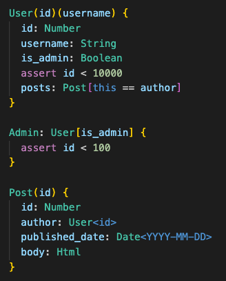

# Kye Language

The Kye Language is a data modeling language that allows you to define your assertions and test your data. To learn more go to [docs.kyelang.org](https://docs.kyelang.org)

This extension provides syntax highlighting for `.kye` files.

## Release Notes

### 0.0.1

Initial release of extension